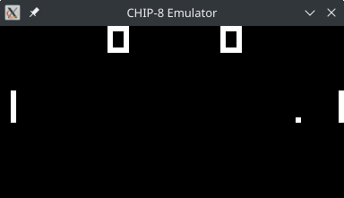
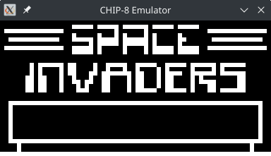

# chip8-rs

A CHIP-8 Emulator written in Rust. Currently working with the exception of sound.
The Emulator's clock speed, window size and pixel size are configured through the use of constants defined in `chip8.rs`. Their values can be altered to change some behavior.

## Building

These instructions assume that both git and Rust toolchain are installed and available.

``` sh
$ git clone https://github.com/vcoutasso/chip8-rs ; cd bf-rs # Clone repository and cd into the directory
$ cargo build --release # The release flag is optional but recommended
```

## Usage

``` sh
$ cargo run --release <PATH/TO/ROM>
```

## Keypad

The original CHIP-8 had a 16-key hexadecimal keypad with the following layout:

|   |   |   |   |
|---|---|---|---|
| 1 | 2 | 3 | C |
| 4 | 5 | 6 | D |
| 7 | 8 | 9 | E |
| A | 0 | B | F |

The following is the implemented layout that better fits the QWERTY keyboard layout:

|   |   |   |   |
|---|---|---|---|
| Q | W | E | R |
| A | S | D | F |
| U | I | O | P |
| J | K | L | ; |


## Screenshots

The following are screenshots of the Emulator working with default settings on some well-known ROM files.





## License

This software is free to use under the MIT License. See [this reference](https://choosealicense.com/licenses/mit/) for more information.
